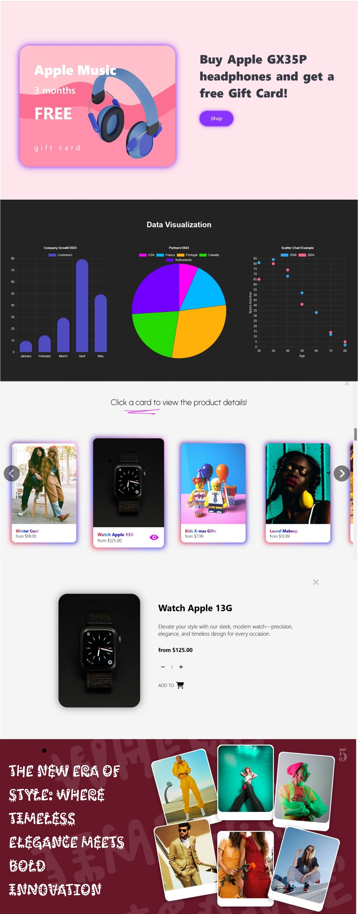

**Front End Animations**  
**_NextJS, CSS, GSAP_**

- implemented SVG text and arrow animations using GSAP for smooth, gradual path-based emergence
- created staggered animations for navigation bar buttons and cards to enhance user experience with seamless transitions.
- developed scroll-linked animations to trigger dynamic visual effects as users navigate through the page
- visualized dynamic data using Chart.js

